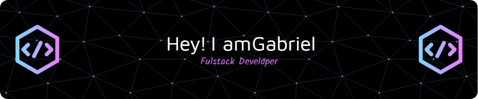

## Hi there 

Olá, sou Gabriel, um desenvolvedor apaixonado por criar soluções web completas. Atualmente foco no frontend com React, mas também tenho experiência no backend com Node.js e .NET. Estou cursando Análise e Desenvolvimento de Sistemas.

    🧠 Linguagens: <strong>C#, .NET, Javascript, Typescript, HTML, CSS</strong>

    ⚙️ Frameworks e libs: <strong>.NET, ASP.NET Core, React, React Native, Node, Express, Tailwind, Bootstrap</strong>

    🗃 Bancos: <strong>SQL Server, PostgreSQL, DynamoDB</strong>

    ☁ Cloud: <strong>Azure, AWS</strong>

    🔄 Versionamento: <strong>Git, GitHub, Azure DevOps</strong>

    🚀 Deploy: <strong>Vercel, Azure App Services, GitHub Pages</strong>

    🛠 Ferramentas: <strong>Visual Studio, VS Code, Postman, Azure DevOps, Figma</strong>

    💻 Sistemas Operacionais: <strong>Windows, Linux</strong>

